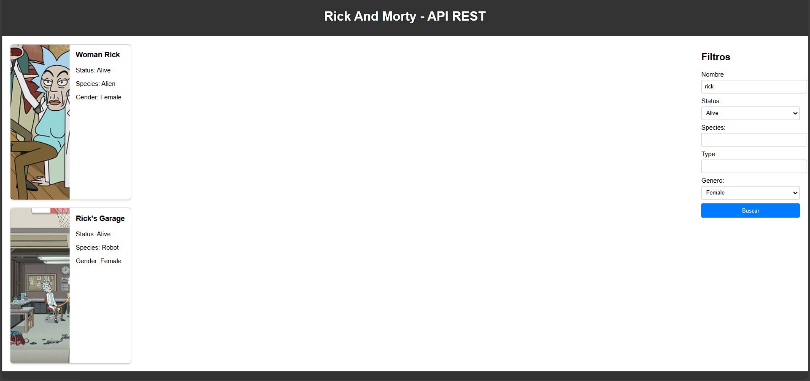

# 🛸 Rick and Morty - API REST

Web interactiva que consume la API de Rick and Morty para mostrar información detallada de los personajes de la serie.

## 🔧 Funcionalidades

- **Búsqueda de personajes** 🔍 - Busca por nombre de personaje
- **Filtros avanzados** 📊 - Filtra por estado, especie, tipo y género
- **Información detallada** 📋 - Muestra datos completos de cada personaje
- **Interfaz responsive** 📱 - Adaptable a diferentes dispositivos
- **Navegación intuitiva** 🎯 - Fácil exploración de los resultados

## 📋 Datos Mostrados

- **Imagen del personaje** 🖼️ - Avatar oficial del personaje
- **Estado** 💚 - Vivo, muerto o desconocido
- **Especie** 🧬 - Humano, alienígena, robot, etc.
- **Género** ⚧️ - Masculino, femenino, sin género, desconocido

## 🚀 Tecnologías Utilizadas

- **HTML5** - Estructura de la aplicación
- **CSS3** - Estilos y diseño responsive
- **JavaScript** - Lógica de la aplicación y consumo de API

## 🌐 API Utilizada

[Rick and Morty API](https://rickandmortyapi.com/api/)
## Autor

- [@AgustinGalan02](https://www.github.com/AgustinGalan02)

##Badges

